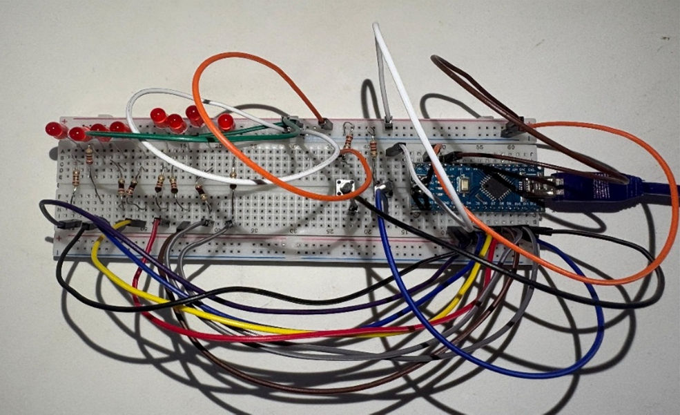

# Lab 1 — LED Control Circuit

## Objective
Design and implement a microcontroller-based LED sequence system using Arduino Nano.

---

## Hardware Used
- Arduino Nano
- Breadboard
- LEDs
- Resistors
- Push buttons
- Jumper wires

---

## Experimental Setup

---

## Features
- LED animation sequencing
- Push-button interaction
- Configurable timing behaviour
- Multi-step LED patterns

---

## Implementation Details
The LED sequence logic was implemented using a 2D array structure where each row represents one animation frame and each column corresponds to an LED state.

A custom sequence function updates outputs dynamically to generate animation patterns efficiently.

---

## Challenges Encountered
- Learning Arduino syntax and structure
- Managing nested loops and arrays
- Designing efficient sequence logic
- Reducing repetitive code

---

## Future Improvements
- Replace delay() with millis()
- Improve code modularity
- Optimize sequence storage
- Improve readability and comments

---

## Code
Main implementation:
- `led_sequence_controller.ino`