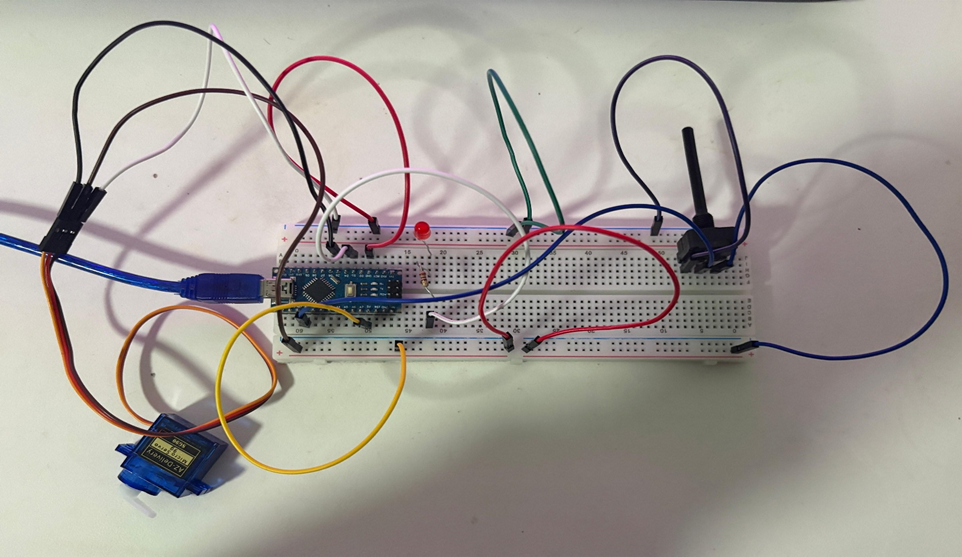

# Lab 2 — Servo Motor Control

## Objective
Implement a microcontroller-based servo motor control system using Arduino Nano and analogue input processing.

---

## Hardware Used
- Arduino Nano
- Micro servo motor
- Potentiometer
- Breadboard
- LEDs
- Jumper wires

---

## Experimental Setup

---

## Features
- Servo motor angle control using potentiometer input
- PWM-based LED brightness control
- Voltage-dependent onboard LED behavior
- Non-blocking timing using millis()

---

## Technical Concepts
- Analogue signal acquisition
- PWM output control
- Servo motor control
- Voltage mapping using map()
- Non-blocking timing with millis()

---

## Challenges Encountered
- Understanding PWM behavior
- Learning servo library integration
- Implementing non-blocking timing logic
- Structuring conditional logic cleanly

---

## Future Improvements
- Modularize logic into functions
- Improve serial debugging output
- Add servo safety limits
- Improve code readability

---

## Files
- `servo_control.ino`
- `setup.png`