# Lab 3 — Capacitor Charging Behaviour in RC Circuits

## Objective
Investigate the charging behaviour of capacitors in RC circuits using an Arduino Nano and compare experimentally measured charging curves with the theoretical exponential charging model.

---

## Hardware Used
- Arduino Nano
- Breadboard
- Electrolytic capacitors
- Resistors
- Pushbutton
- Jumper wires
- USB serial communication

---

## Technical Concepts
- RC circuits
- Capacitor charging behaviour
- Time constant (\tau = RC)
- Analogue voltage measurement
- ADC conversion
- Serial telemetry
- Experimental data analysis
- Theoretical vs measured comparison

---

# Experimental Setup

The Arduino Nano measures the voltage across a charging capacitor through analogue input pin A0. The capacitor is charged through a resistor connected to the 5 V output of the Arduino.

A pushbutton is used to discharge the capacitor before each measurement. Once released, the charging process begins automatically and the Arduino records voltage values over time.

The measured data is transmitted through serial communication and analysed using Excel.

---

# Measurement Method

The program continuously monitors capacitor voltage using `analogRead()`.

A threshold-based measurement system is implemented to:
- detect capacitor discharge
- arm the system for a new measurement
- automatically start timing
- sample voltage periodically
- stop recording after a defined duration

Voltage values are converted from ADC readings into volts and streamed through serial communication in CSV-style format for plotting and analysis.

The elapsed time is measured using the `millis()` function.

---

# Program Features
- Automatic charging detection
- Non-blocking timing using `millis()`
- Real-time voltage sampling
- Serial telemetry output
- Configurable measurement duration
- Reusable measurement logic for multiple RC configurations

---

# Experiment 1 — Curve 1

## Circuit Parameters
- Resistance: 10 kΩ
- Capacitance: 220 µF
- Time Constant:
  
\tau = RC = 2.20 s

## Setup

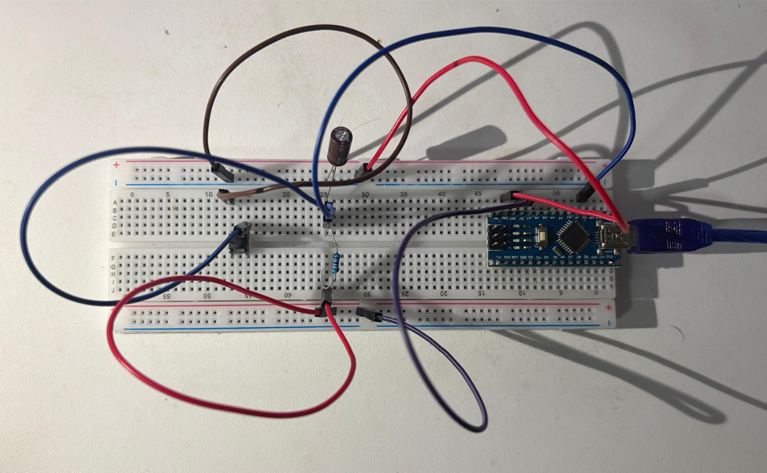

## Measured Charging Curve

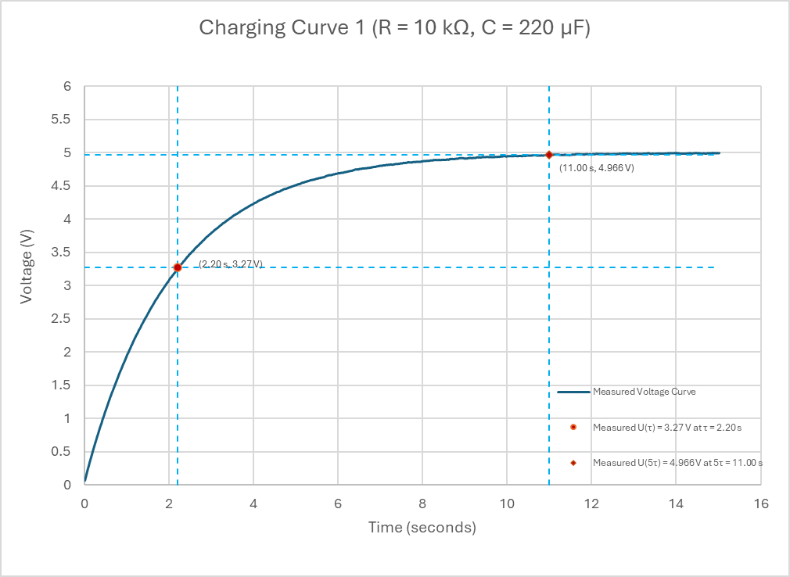

## Theoretical vs Measured Comparison

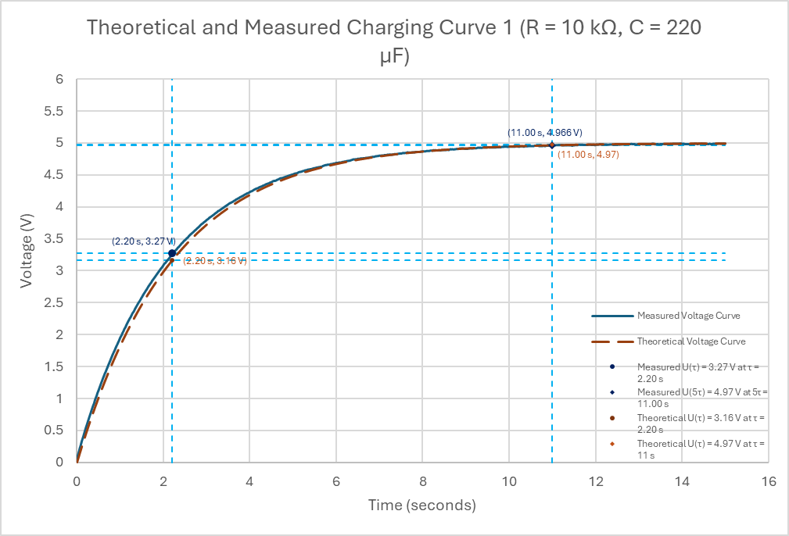

## Observations
- Fastest charging behaviour among all experiments
- Measured voltage reached approximately 63% of final voltage near one time constant
- Experimental results closely followed the theoretical exponential charging curve

---

# Experiment 2 — Curve 2

## Circuit Parameters
- Resistance: 12.5 kΩ
- Capacitance: 660 µF
- Time Constant:

\tau = RC = 8.25 s

## Setup

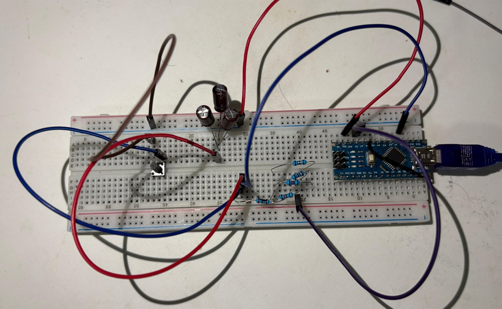

## Measured Charging Curve

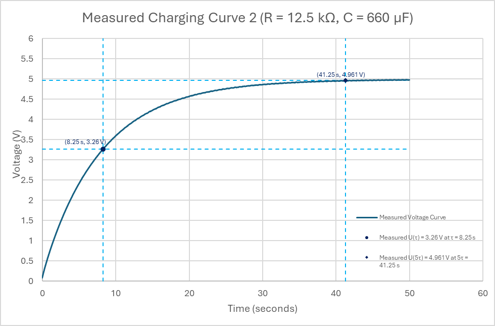

## Theoretical vs Measured Comparison

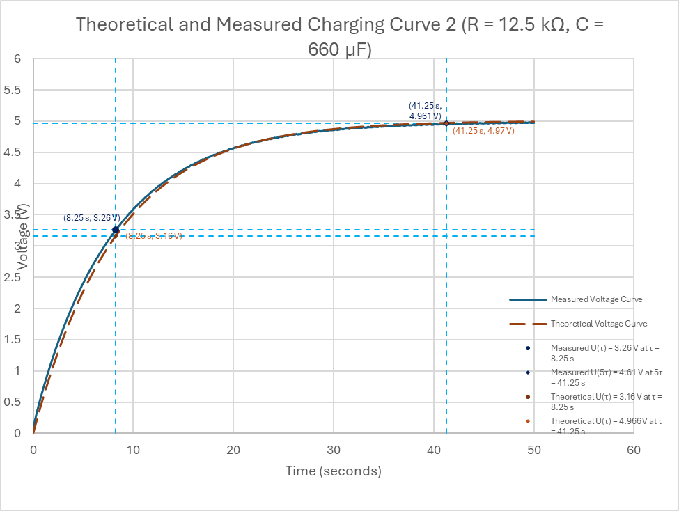

## Observations
- Slower charging process due to larger RC time constant
- Charging curve maintained expected exponential behaviour
- Measured and theoretical curves showed strong agreement

---

# Experiment 3 — Curve 3

## Circuit Parameters
- Resistance: 50 kΩ
- Capacitance: 440 µF
- Time Constant:

\tau = RC = 22.0 s

## Setup

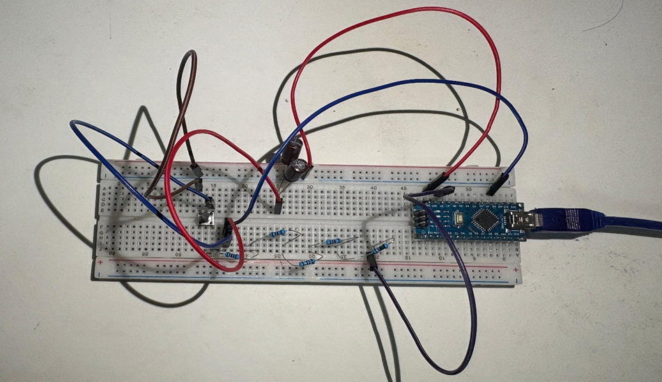

## Measured Charging Curve

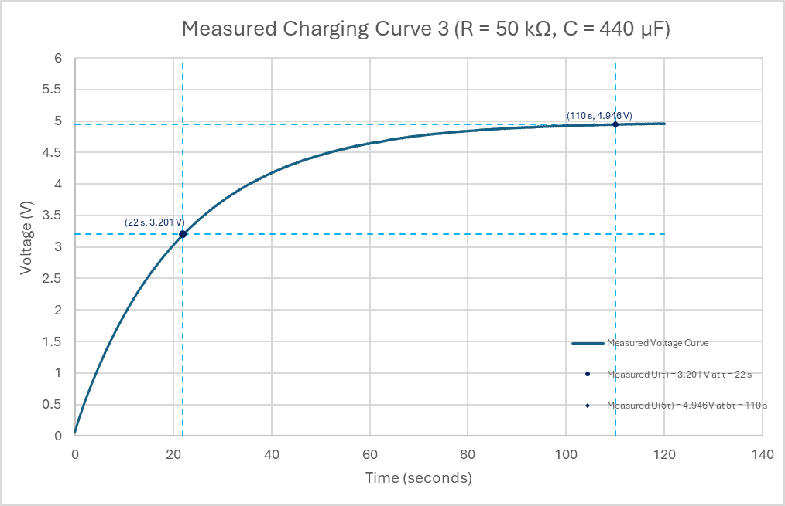

## Theoretical vs Measured Comparison

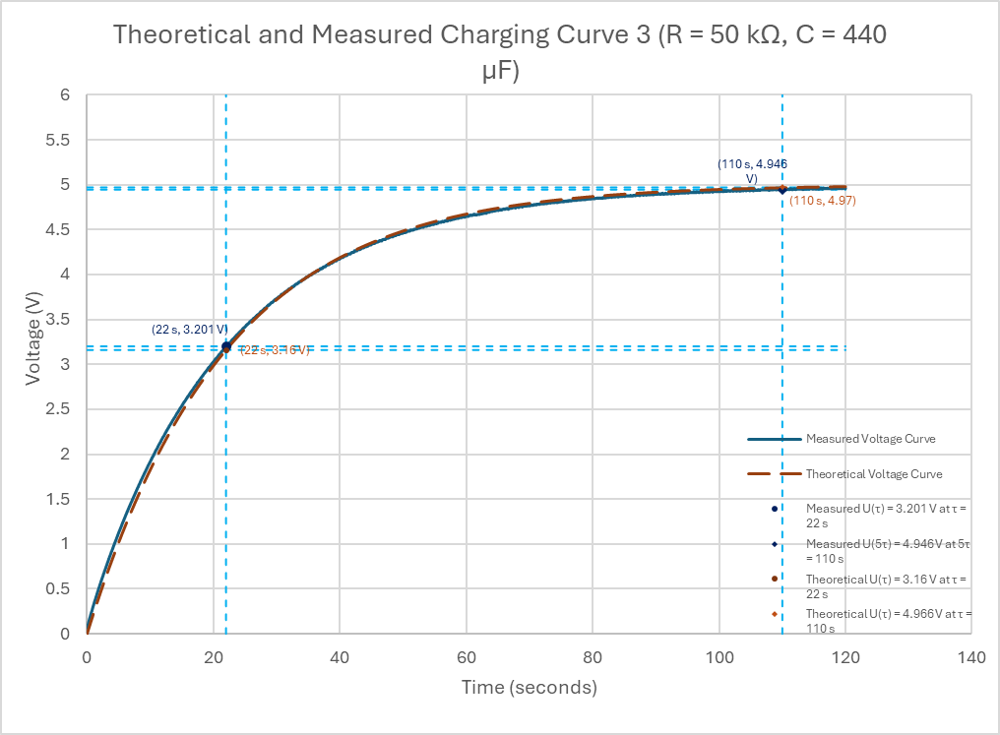

## Observations
- Slowest charging behaviour due to highest resistance
- Lowest initial charging slope
- Strong agreement between measured and theoretical models

---

# Combined Charging Curve Comparison

## Combined Measured Curves

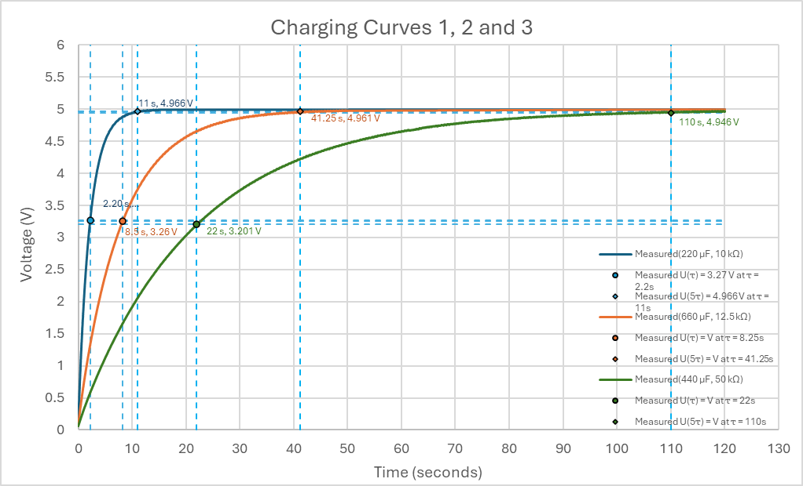

## Combined Measured and Theoretical Curves

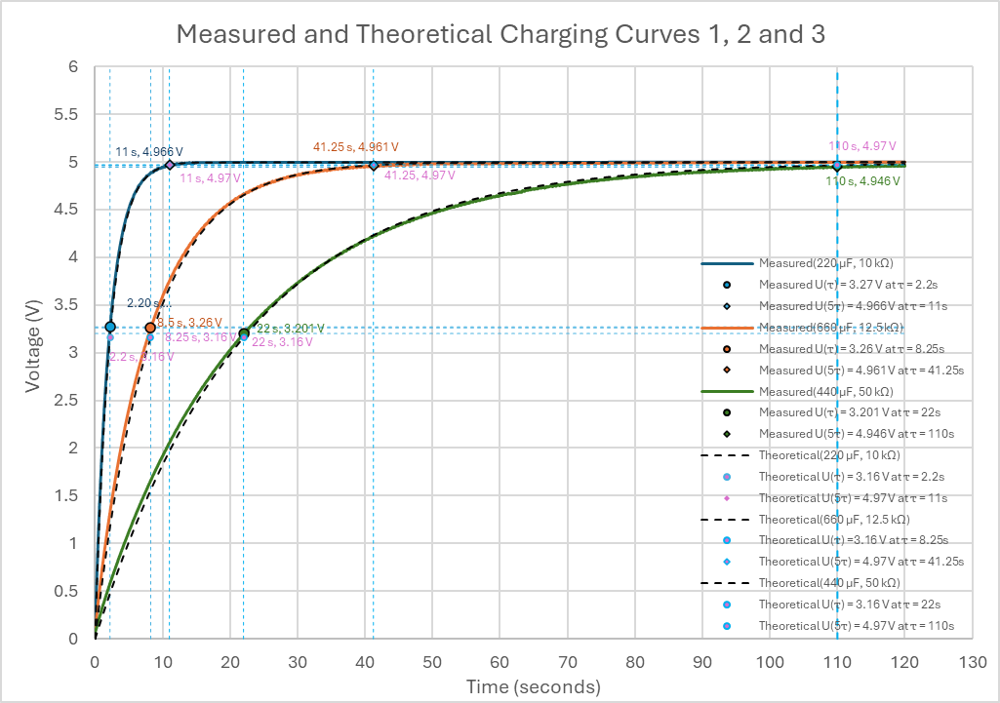

## Discussion
The combined plots clearly demonstrate the influence of the RC time constant on capacitor charging speed.

Increasing resistance and capacitance increased the time constant and slowed the charging process while preserving the characteristic exponential curve shape.

All experimental curves showed good agreement with theoretical predictions.

Minor deviations can be attributed to:
- resistor and capacitor tolerances
- ADC resolution limitations
- supply voltage variation
- measurement noise

---

# Challenges Encountered
- Designing reliable measurement triggering logic
- Understanding RC time constants
- Implementing non-blocking timing with `millis()`
- Exporting and analysing serial telemetry data
- Comparing experimental and theoretical curves

---

# Future Improvements
- Real-time PC plotting dashboard
- Automated serial data logging
- Higher sampling precision
- Signal filtering
- Improved calibration methods
- Modularized measurement software

---

# Files
- `capacitor_test.ino`
- `Curve1/`
- `Curve2/`
- `Curve3/`
- `Combined/`
- Excel analysis worksheets